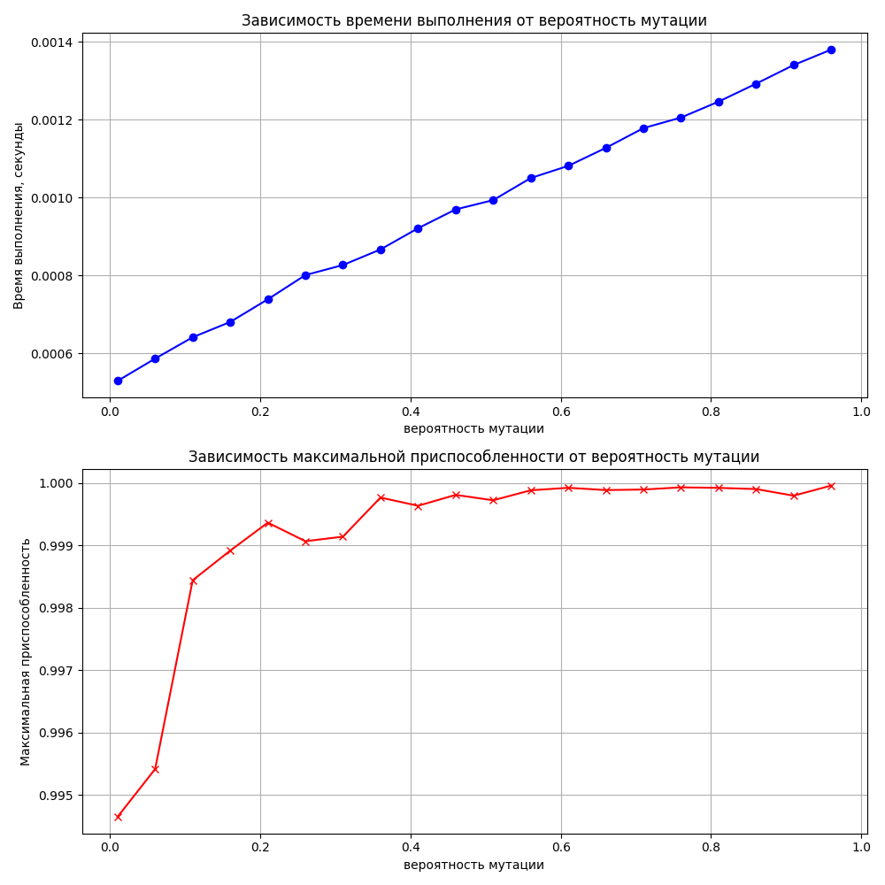
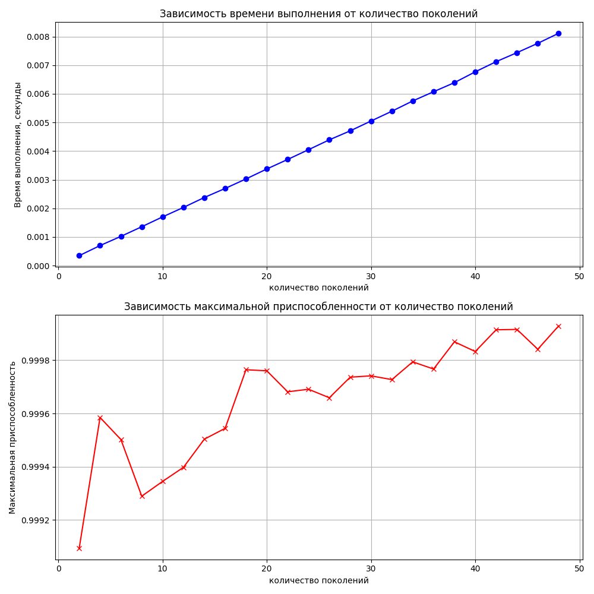
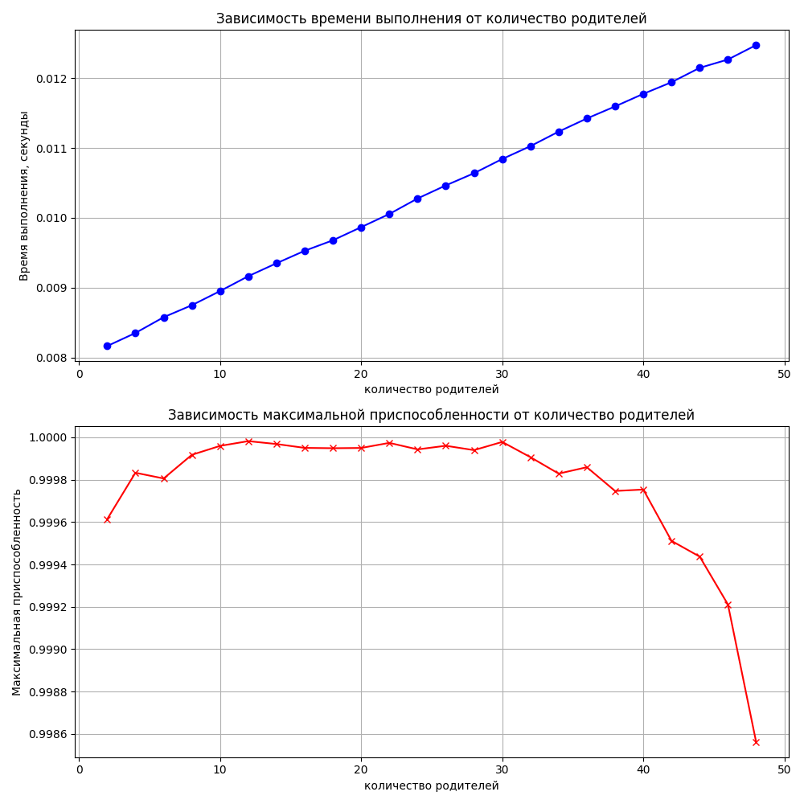
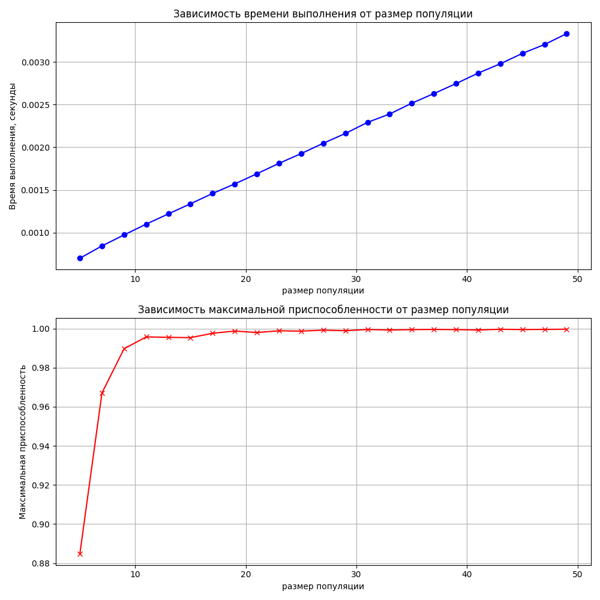

### Введение
Генетические алгоритмы (ГА) являются подклассом эволюционных алгоритмов, мимикрирующих под процесс естественного отбора, который описал Чарльз Дарвин. Они используют механизмы, аналогичные биологической эволюции, такие как мутация, кроссинговер (скрещивание) и селекция, для нахождения решений в сложных задачах оптимизации. ГА особенно полезны в ситуациях, где традиционные подходы оказываются неэффективными, благодаря их способности исследовать широкие пространства решений и находить оптимальные или приближенные к оптимальным решения в сложных условиях.

### Основные параметры генетических алгоритмов

1. **Мощность популяции**: Большое количество особей в популяции увеличивает генетическое разнообразие, что способствует более эффективному поиску решений. Однако это также ведет к увеличению вычислительных затрат, поскольку требует обработки большего количества данных.

2. **Структура представления решения**: Метод кодирования решений может существенно влиять на эффективность ГА. Примерами такого кодирования могут служить бинарные строки для простых задач или более сложные структуры для задач оптимизации с множественными переменными.

3. **Вид генетических операторов**: Выбор и настройка операторов кроссинговера и мутации критически важны для генерации новых и потенциально лучших решений, а также для избегания застревания в локальных оптимумах.

4. **Вероятности кроссинговера и мутации**: Регулирование этих вероятностей позволяет контролировать динамику поиска между исследованием новых областей пространства решений и эксплуатацией уже найденных решений.

Рассмотрим подробнее каждое из достоинств и недостатков генетических алгоритмов (ГА), чтобы лучше понять их применение и ограничения.

### Преимущества Генетических Алгоритмов

1. **Концептуальная простота**
   - Генетические алгоритмы основаны на естественных процессах, таких как естественный отбор и генетическое наследование, что делает их концептуально простыми для понимания и реализации. Эта простота облегчает их применение к широкому кругу задач, даже тем, которые могут быть сложны для анализа с помощью традиционных методов.

2. **Широкая применимость**
   - ГА могут адаптироваться к различным типам задач без необходимости подробного знания их математических моделей. Они эффективны в оптимизации, автоматическом программировании, машинном обучении и других областях, где пространства решений большие и сложно структурированные.

3. **Параллелизм**
   - Независимость особей в популяции позволяет ГА легко адаптироваться к параллельной обработке, значительно ускоряя процесс поиска оптимальных решений. Это делает ГА особенно подходящими для использования на многопроцессорных системах и вычислительных кластерах.

4. **Устойчивость к изменениям**
   - ГА способны адаптироваться к изменяющимся условиям задачи без необходимости полного перезапуска алгоритма. Это делает их идеальными для динамических или развивающихся сред, где требования могут изменяться со временем.

### Недостатки Генетических Алгоритмов

1. **Сложность настройки**
   - Нахождение оптимального набора параметров, таких как размер популяции, вероятности мутации и кроссинговера, может быть сложным и требовать много времени. Эта сложность обусловлена необходимостью балансировки между исследованием пространства решений и эксплуатацией текущих решений, а также зависимостью эффективности ГА от специфики задачи.

2. **Преждевременная сходимость**
   - ГА подвержены риску преждевременной сходимости к локальным оптимумам, особенно в сложных пространствах решений. Это происходит, когда популяция становится слишком однородной, и алгоритм теряет способность генерировать новые, более эффективные решения.

3. **Вычислительные затраты**
   - Для больших популяций и сложных задач ГА могут требовать значительных вычислительных ресурсов. Это особенно актуально в задачах, где оценка каждой особи представляет собой дорогостоящий процесс, например, в сложных инженерных или финансовых моделях.

4. **Теорема No FreeLunch (NFLT)**
   - В соответствии с этой теоремой, ни один алгоритм оптимизации не может гарантировать лучшую производительность по всем возможным задачам. Это означает, что, хотя ГА могут быть чрезвычайно эффективны для определенных типов задач, они не всегда будут лучшим выбором. Теорема подчеркивает важность выбора подходящего инструмента для каждой конкретной задачи и осторожности при обобщении результатов ГА на все задачи.

### Исследование влияния параметров 
Возмем задачу нахождения максимального значения функции двух переменных. В качестве функции возьмем \(f(x, y) = sin(x^2 + y^2)\), где \(x\) и \(y\) могут изменяться в пределах от -3 до 3. Цель генетического алгоритма — найти координаты \(x\) и \(y\), при которых значение функции будет максимальным.

#### Задача
Использовать генетический алгоритм для оптимизации функции \(f(x, y) = sin(x^2 + y^2)\) с ограничениями \(x, y \in [-3, 3]\).

#### Параметры генетического алгоритма
- Размер популяции: количество индивидов в популяции.
- Количество поколений: количество итераций алгоритма.
- Вероятность мутации: шанс случайного изменения гена в индивиде.
- Вероятность кроссовера: шанс на скрещивание двух индивидов для создания потомства.

#### Результаты

[исполняемый код](./main.py)
### Обзор современных исследований по генетическим алгоритмам

Современные исследования генетических алгоритмов фокусируются на улучшении их эффективности, адаптивности и применяемости к разнообразным задачам. Основные направления включают разработку адаптивных генетических алгоритмов, где параметры алгоритма, такие как вероятность мутации или кроссинговера, динамически изменяются в процессе выполнения для улучшения процесса поиска. Также исследуются гибридные подходы, сочетающие ГА с другими методами оптимизации, например, с машинным обучением или классическими алгоритмами поиска, что позволяет сочетать сильные стороны различных подходов для решения специфических задач.

Исследователи изучают применение генетических алгоритмов в различных областях, включая оптимизацию сложных инженерных систем, разработку программного обеспечения, финансовое моделирование и биоинформатику. Особенно интересны результаты применения ГА для решения задач многокритериальной оптимизации, где необходимо найти баланс между несколькими, зачастую противоречивыми, целями.

### Выводы

Генетические алгоритмы представляют собой мощный инструмент для решения широкого круга оптимизационных задач, особенно тех, которые трудно поддаются анализу с помощью классических методов. Они показывают высокую эффективность в многокритериальной и мультимодальной оптимизации, а также в задачах, где пространство решений имеет сложную структуру. Несмотря на определенные недостатки, такие как сложность настройки параметров и потенциальная вычислительная затратность, исследования и разработки последних лет значительно расширили возможности и области применения ГА.

### Список источников информации
1. Deepa S.N., Sivanandam S.N. Introduction to genetic algorithms. Berlin, Heidelberg: Springer- Verlag, 2008.
2. Macready W.G., Wolpert D.H. No free lunch theorems for search / Operations research Santa Fe Institute, 1995.
3. Macready W.G., Wolpert D. H. No Free Lunch Theorems for Search Technical. 1996. Report SFI-TR-95-02-010. - Sania Fe Instituie.
4. https://www.sciencedirect.com/science/article/abs/pii/S0925527302001044#:~:text=Genetic%20Algorithm%20programs%20include%20a,within%20a%20given%20execution%20time.
5. https://www.obitko.com/tutorials/genetic-algorithms/parameters.php  
