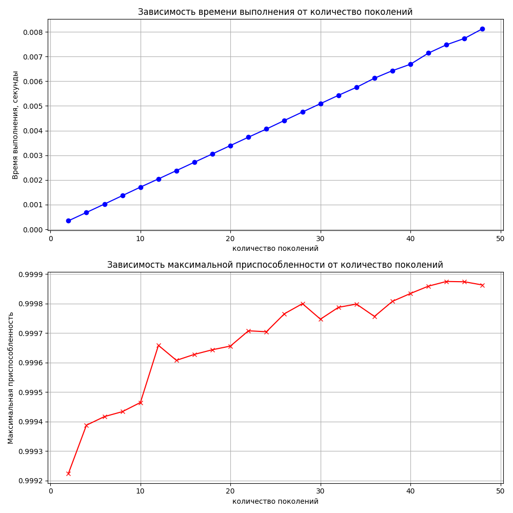
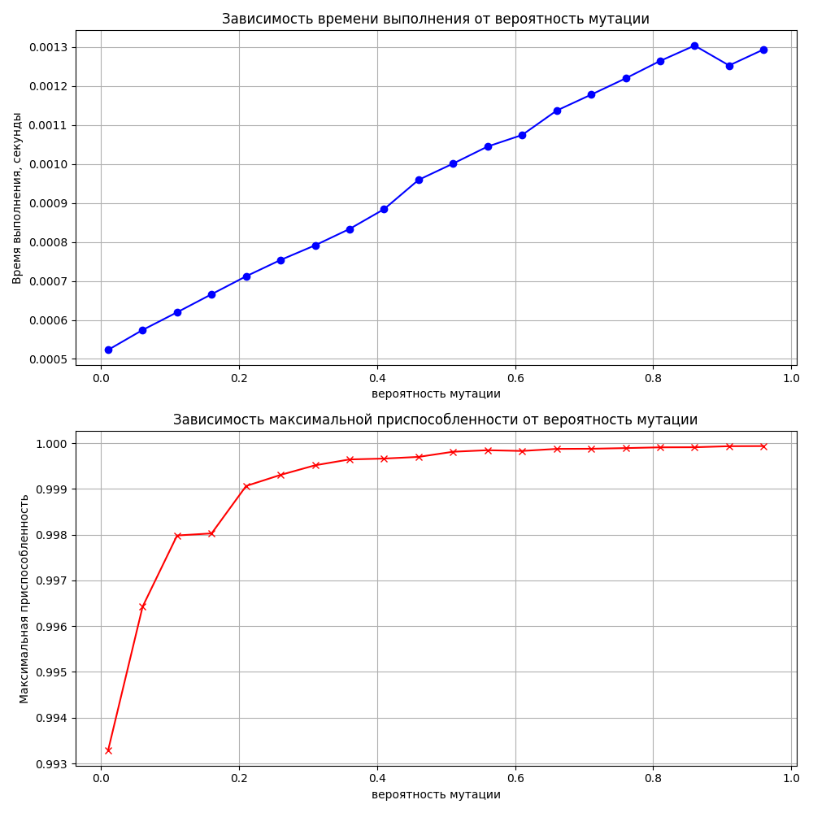

## Введение
Генетические алгоритмы (ГА) являются подклассом эволюционных алгоритмов, мимикрирующих под процесс естественного отбора, который описал Чарльз Дарвин. Они используют механизмы, аналогичные биологической эволюции, такие как мутация, кроссинговер (скрещивание) и селекция, для нахождения решений в сложных задачах оптимизации. ГА особенно полезны в ситуациях, где традиционные подходы оказываются неэффективными, благодаря их способности исследовать широкие пространства решений и находить оптимальные или приближенные к оптимальным решения в сложных условиях.

## Основные параметры генетических алгоритмов

1. **Мощность популяции**: Большое количество особей в популяции увеличивает генетическое разнообразие, что способствует более эффективному поиску решений. Однако это также ведет к увеличению вычислительных затрат, поскольку требует обработки большего количества данных.

2. **Структура представления решения**: Метод кодирования решений может существенно влиять на эффективность ГА. Примерами такого кодирования могут служить бинарные строки для простых задач или более сложные структуры для задач оптимизации с множественными переменными.

3. **Вид генетических операторов**: Выбор и настройка операторов кроссинговера и мутации критически важны для генерации новых и потенциально лучших решений, а также для избегания застревания в локальных оптимумах.

4. **Вероятности кроссинговера и мутации**: Регулирование этих вероятностей позволяет контролировать динамику поиска между исследованием новых областей пространства решений и эксплуатацией уже найденных решений.

Рассмотрим подробнее каждое из достоинств и недостатков генетических алгоритмов (ГА), чтобы лучше понять их применение и ограничения.

## Преимущества Генетических Алгоритмов

1. **Концептуальная простота**
   - Генетические алгоритмы основаны на естественных процессах, таких как естественный отбор и генетическое наследование, что делает их концептуально простыми для понимания и реализации. Эта простота облегчает их применение к широкому кругу задач, даже тем, которые могут быть сложны для анализа с помощью традиционных методов.

2. **Широкая применимость**
   - ГА могут адаптироваться к различным типам задач без необходимости подробного знания их математических моделей. Они эффективны в оптимизации, автоматическом программировании, машинном обучении и других областях, где пространства решений большие и сложно структурированные.

3. **Параллелизм**
   - Независимость особей в популяции позволяет ГА легко адаптироваться к параллельной обработке, значительно ускоряя процесс поиска оптимальных решений. Это делает ГА особенно подходящими для использования на многопроцессорных системах и вычислительных кластерах.

4. **Устойчивость к изменениям**
   - ГА способны адаптироваться к изменяющимся условиям задачи без необходимости полного перезапуска алгоритма. Это делает их идеальными для динамических или развивающихся сред, где требования могут изменяться со временем.

### Недостатки Генетических Алгоритмов

1. **Сложность настройки**
   - Нахождение оптимального набора параметров, таких как размер популяции, вероятности мутации и кроссинговера, может быть сложным и требовать много времени. Эта сложность обусловлена необходимостью балансировки между исследованием пространства решений и эксплуатацией текущих решений, а также зависимостью эффективности ГА от специфики задачи.

2. **Преждевременная сходимость**
   - ГА подвержены риску преждевременной сходимости к локальным оптимумам, особенно в сложных пространствах решений. Это происходит, когда популяция становится слишком однородной, и алгоритм теряет способность генерировать новые, более эффективные решения.

3. **Вычислительные затраты**
   - Для больших популяций и сложных задач ГА могут требовать значительных вычислительных ресурсов. Это особенно актуально в задачах, где оценка каждой особи представляет собой дорогостоящий процесс, например, в сложных инженерных или финансовых моделях.

4. **Теорема No FreeLunch (NFLT)**
   - В соответствии с этой теоремой, ни один алгоритм оптимизации не может гарантировать лучшую производительность по всем возможным задачам. Это означает, что, хотя ГА могут быть чрезвычайно эффективны для определенных типов задач, они не всегда будут лучшим выбором. Теорема подчеркивает важность выбора подходящего инструмента для каждой конкретной задачи и осторожности при обобщении результатов ГА на все задачи.

## Исследование влияния параметров 
Возмем задачу нахождения максимального значения функции двух переменных. В качестве функции возьмем \(f(x, y) = sin(x^2 + y^2)\), где \(x\) и \(y\) могут изменяться в пределах от -3 до 3. Цель генетического алгоритма — найти координаты \(x\) и \(y\), при которых значение функции будет максимальным.

### Задача
Использовать генетический алгоритм для оптимизации функции \(f(x, y) = sin(x^2 + y^2)\) с ограничениями \(x, y \in [-3, 3]\).

### Параметры генетического алгоритма
- Размер популяции: количество индивидов в популяции.
- Количество поколений: количество итераций алгоритма.
- Вероятность мутации: шанс случайного изменения гена в индивиде.
- Вероятность кроссовера: шанс на скрещивание двух индивидов для создания потомства.

### Результаты тестирования
#### График зависимости от размера популяции

На графике представлены две зависимости: время выполнения генетического алгоритма и максимальная приспособленность от размера популяции. Рассмотрим каждую из них:

1. **Зависимость времени выполнения от размера популяции (верхний график, синий цвет)**:
   - Наблюдается четкая линейная зависимость между размером популяции и временем выполнения алгоритма. С увеличением размера популяции время выполнения растет, что логично, так как для большего числа индивидуумов требуется больше времени на оценку приспособленности и проведение операций кроссовера и мутации.
   - График не показывает резких выбросов или необычных изменений, что указывает на стабильность алгоритма в отношении времени выполнения при изменении размера популяции.

2. **Зависимость максимальной приспособленности от размера популяции (нижний график, красный цвет)**:
   - На графике видно, что с увеличением размера популяции максимальная приспособленность быстро возрастает и достигает своего пика, после чего значение стабилизируется. Такой рост в начале может быть связан с тем, что большая популяция обеспечивает большее генетическое разнообразие, что увеличивает шансы на нахождение более приспособленных индивидуумов.
   - Плато на графике приспособленности показывает, что после достижения определенного размера популяции дальнейшее увеличение численности не приводит к значительным улучшениям. Это может свидетельствовать о том, что оптимальный размер популяции для данной задачи уже достигнут и что дополнительное увеличение размера популяции не является эффективным с точки зрения улучшения качества решений.

В общем, первый график показывает, что существует определенный оптимальный диапазон размеров популяции, при котором алгоритм работает эффективно, обеспечивая хорошее сочетание времени выполнения и качества решения. Нахождение этого оптимального диапазона может потребовать дополнительного анализа и экспериментов, особенно если учитывать другие параметры алгоритма, такие как количество поколений и вероятность мутации.

#### График зависимости от количествва родителей

На графике изображены две зависимости: время выполнения алгоритма и максимальная приспособленность от количества родителей для скрещивания. Проанализируем обе зависимости:

1. **Зависимость времени выполнения от количества родителей (верхний график, синий цвет)**:
   - График показывает, что с увеличением количества родителей время выполнения алгоритма увеличивается. Это может быть связано с тем, что при большем числе родителей требуется больше времени для процесса кроссовера, поскольку количество возможных комбинаций для создания потомства увеличивается.
   - Зависимость времени выполнения от количества родителей не является строго линейной, но все же наблюдается тенденция к увеличению времени с ростом числа родителей. Это предполагает, что увеличение числа родителей заставляет алгоритм тратить больше времени на генерацию нового поколения.

2. **Зависимость максимальной приспособленности от количества родителей (нижний график, красный цвет)**:
   - Максимальная приспособленность вначале растет с увеличением числа родителей, что указывает на то, что увеличение генетического разнообразия потомства может способствовать улучшению качества решений.
   - После достижения пика приспособленности при определенном числе родителей наблюдается ее снижение. Это может означать, что слишком большое количество родителей вносит избыточное разнообразие, в результате чего теряются некоторые хорошие генетические комбинации, или происходит слишком большое размывание полезных признаков, что ведет к ухудшению качества решений.
   - На графике также видны некоторые колебания максимальной приспособленности после достижения пика. Эти колебания могут быть результатом случайных флуктуаций в процессе генетического алгоритма или особенностей задачи оптимизации.

Этот график иллюстрирует, что существует оптимальное количество родителей для скрещивания, которое максимизирует приспособленность решений. Найти это оптимальное число важно для эффективности генетического алгоритма, поскольку оно влияет и на качество решения, и на время выполнения. Слишком малое число родителей может не обеспечить достаточного разнообразия, тогда как слишком большое — может привести к избыточному разнообразию и потере качественных генетических комбинаций.

#### График зависимости от количетсва поколений (res3.png)

На графике представлены зависимости времени выполнения генетического алгоритма и максимальной приспособленности от количества поколений. Рассмотрим каждую зависимость подробнее:

1. **Зависимость времени выполнения от количества поколений (верхний график, синий цвет)**:
   - Время выполнения алгоритма увеличивается линейно по мере увеличения количества поколений. Это ожидаемо, поскольку каждое дополнительное поколение требует дополнительного времени на применение операций отбора, кроссовера и мутации ко всей популяции.
   - Линейный характер увеличения времени выполнения показывает, что каждое новое поколение вносит приблизительно одинаковый вклад в общее время выполнения алгоритма, что свидетельствует о стабильности процессов, происходящих в алгоритме от поколения к поколению.

2. **Зависимость максимальной приспособленности от количества поколений (нижний график, красный цвет)**:
   - Наблюдается интересный тренд: сначала приспособленность растет с увеличением количества поколений, что свидетельствует о том, что алгоритм находит более оптимальные решения по мере продолжения эволюционного процесса.
   - После определенного количества поколений приспособленность достигает плато и начинает колебаться. Это может указывать на то, что алгоритм достиг определенной степени оптимизации и дополнительные поколения не приводят к значительному улучшению решений, возможно, из-за преждевременной конвергенции или из-за того, что лучшие возможные решения в рамках текущей структуры популяции и операций уже найдены.
   - Колебания приспособленности на плато могут отражать случайные вариации в процессе отбора и мутаций, что является нормальным явлением для стохастических алгоритмов, таких как генетические.

Этот график показывает, что количество поколений является важным параметром, который напрямую влияет на время выполнения алгоритма и косвенно — на качество решения. Оптимальное количество поколений зависит от задачи и должно быть достаточным для достижения сходимости, но не слишком велико, чтобы избежать ненужных вычислений после того, как дополнительные улучшения становятся минимальными или отсутствуют.

#### График зависимости от вероятности мутации

На графике показаны две зависимости: время выполнения алгоритма и максимальная приспособленность от вероятности мутации в генетическом алгоритме. Рассмотрим каждую из зависимостей по отдельности:

1. **Зависимость времени выполнения от вероятности мутации (верхний график, синий цвет)**:
   - Время выполнения алгоритма постепенно увеличивается с ростом вероятности мутации. Это может быть связано с тем, что более высокая вероятность мутации ведет к более значительным изменениям в популяции, которые требуют дополнительного времени для оценки приспособленности.
   - Последняя точка на графике показывает уменьшение времени выполнения при максимальной вероятности мутации. Это может быть результатом случайной вариации или особенностей конкретного запуска алгоритма и может не отражать общую тенденцию.

2. **Зависимость максимальной приспособленности от вероятности мутации (нижний график, красный цвет)**:
   - На начальном этапе с увеличением вероятности мутации наблюдается быстрый рост максимальной приспособленности. Это свидетельствует о том, что введение мутаций способствует улучшению качества решений, возможно, позволяя выйти из локальных оптимумов.
   - Дальнейшее увеличение вероятности мутации приводит к постепенному выходу на плато. Это может означать, что достигнут оптимальный уровень мутации, при котором алгоритм находит решения близкие к оптимальным, но дополнительные мутации не приводят к значительному улучшению.
   - При очень высоких значениях вероятности мутации качество решений несколько снижается. Это может быть признаком того, что слишком частые мутации разрушают хорошие генетические комбинации быстрее, чем алгоритм успевает их отбирать, что ведет к деградации качества популяции.

В целом, эти графики показывают, что вероятность мутации является важным параметром генетического алгоритма, влияющим как на время выполнения, так и на качество найденного решения. Наиболее оптимальные значения вероятности мутации лежат в промежутке, где максимальная приспособленность достигает плато. Это предполагает баланс между достаточным введением новизны в популяцию для избегания локальных оптимумов и поддержанием стабильности генетического материала для обеспечения сходимости к хорошему решению.

[исполняемый код](./main.py)

### Обзор современных исследований по генетическим алгоритмам

Современные исследования генетических алгоритмов фокусируются на улучшении их эффективности, адаптивности и применяемости к разнообразным задачам. Основные направления включают разработку адаптивных генетических алгоритмов, где параметры алгоритма, такие как вероятность мутации или кроссинговера, динамически изменяются в процессе выполнения для улучшения процесса поиска. Также исследуются гибридные подходы, сочетающие ГА с другими методами оптимизации, например, с машинным обучением или классическими алгоритмами поиска, что позволяет сочетать сильные стороны различных подходов для решения специфических задач.

Исследователи изучают применение генетических алгоритмов в различных областях, включая оптимизацию сложных инженерных систем, разработку программного обеспечения, финансовое моделирование и биоинформатику. Особенно интересны результаты применения ГА для решения задач многокритериальной оптимизации, где необходимо найти баланс между несколькими, зачастую противоречивыми, целями.

### Выводы

Генетические алгоритмы представляют собой мощный инструмент для решения широкого круга оптимизационных задач, особенно тех, которые трудно поддаются анализу с помощью классических методов. Они показывают высокую эффективность в многокритериальной и мультимодальной оптимизации, а также в задачах, где пространство решений имеет сложную структуру. Несмотря на определенные недостатки, такие как сложность настройки параметров и потенциальная вычислительная затратность, исследования и разработки последних лет значительно расширили возможности и области применения ГА.

### Список источников информации
1. Deepa S.N., Sivanandam S.N. Introduction to genetic algorithms. Berlin, Heidelberg: Springer- Verlag, 2008.
2. Macready W.G., Wolpert D.H. No free lunch theorems for search / Operations research Santa Fe Institute, 1995.
3. Macready W.G., Wolpert D. H. No Free Lunch Theorems for Search Technical. 1996. Report SFI-TR-95-02-010. - Sania Fe Instituie.
4. https://www.sciencedirect.com/science/article/abs/pii/S0925527302001044#:~:text=Genetic%20Algorithm%20programs%20include%20a,within%20a%20given%20execution%20time.
5. https://www.obitko.com/tutorials/genetic-algorithms/parameters.php  
